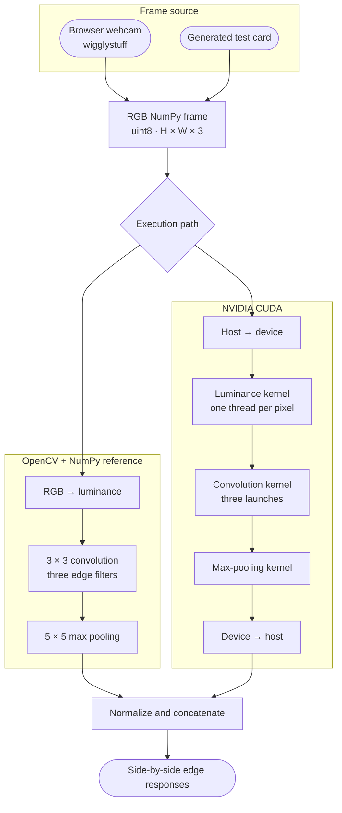

# NCCV: a short course on computer vision and image processing

NCCV teaches the computational foundations behind modern deep learning through
computer vision. Images are a useful teaching medium because every array,
filter, feature map, and mistake can be seen. The course moves from OpenCV and
NumPy into CUDA threads, memory, kernels, convolution, and pooling.

Later lessons will build these operations into a convolutional neural network,
train it, and then express the same model in PyTorch. A final bridge from
convolution to matrix multiplication and attention will prepare learners to
study transformers and LLMs with a working understanding of the computation
underneath.

Every lesson is an executable [marimo](https://marimo.io) notebook with reactive
controls and inspectable results. Run the CPU examples locally or launch a
lesson in molab and select an NVIDIA GPU from the notebook specs menu. Molab
provides the hosted CUDA environment, so you do not need a local NVIDIA setup.

| Lesson | Topics | Launch |
|---|---|---|
| **[1 · Processing webcam frames with OpenCV on GPU](1_processing_webcam_frames_with_opencv_on_gpu.py)** | Browser webcam capture, RGB arrays, mirroring, grayscale, Canny edges, JPEG vs. PNG | [](https://molab.marimo.io/github/ktaletsk/NCCV/blob/main/1_processing_webcam_frames_with_opencv_on_gpu.py/server) |
| **[2 · Writing CUDA kernels for convolution and pooling](2_cuda_kernels_and_convolution.py)** | 2D launch grids, luminance, convolution matrices, max pooling, CPU vs. NVIDIA CUDA | [](https://molab.marimo.io/github/ktaletsk/NCCV/blob/main/2_cuda_kernels_and_convolution.py/server) |

## Learn what the frameworks automate

The course follows a deliberate order. Start with a readable OpenCV and NumPy
reference, write the operation as an NVIDIA GPU kernel, then meet the PyTorch
abstraction built on the same ideas. That order grounds device transfers,
tensor shapes, kernel launches, and automatic differentiation in code the
learner has already written.

## Course flow

### 1 · Processing webcam frames with OpenCV on GPU

Capture a frame from the front or rear camera, mirror it, and apply color,
grayscale, or Canny edge transforms with OpenCV. Encode the result in memory as
JPEG or PNG and compare size and processing time. The resulting NumPy arrays
are ready for the GPU pipeline in lesson 2.

Further reading: [Displaying real-time webcam streams in Python notebooks](https://medium.com/@kostal91/displaying-real-time-webcam-stream-in-ipython-at-relatively-high-framerate-8e67428ac522)

### 2 · Writing CUDA kernels for convolution and pooling

Follow a webcam frame or generated test card through the complete pipeline:



The GPU implementation uses NVIDIA's
[`numba-cuda-mlir`](https://github.com/NVIDIA/numba-cuda-mlir) compiler with
CUDA 13.0. This project targets NVIDIA CUDA only.

## Run locally

Install [uv](https://docs.astral.sh/uv/), clone the repository, and open either
notebook from the lesson table:

```bash
uvx marimo@0.23.13 edit --sandbox <notebook.py>
```

Marimo creates an isolated environment and installs the notebook's inline
dependencies on first run.

## Stack

- [marimo](https://marimo.io) for reactive notebooks and apps
- [wigglystuff](https://github.com/koaning/wigglystuff) for browser webcam capture
- [OpenCV](https://opencv.org) and NumPy for image processing and CPU references
- [Numba-CUDA-MLIR](https://github.com/NVIDIA/numba-cuda-mlir) for NVIDIA GPU kernels
- [uv](https://docs.astral.sh/uv/) for isolated notebook environments

## Course direction

The course roadmap continues with:

- Lesson 3: profile and optimize convolution with memory coalescing, shared
  memory, tiled kernels, and explicit streams and events through `cuda.core`.
- Lesson 4: assemble convolution, activation, pooling, and dense layers into a
  small CNN, with every intermediate tensor visible.
- Lesson 5: implement loss, gradient descent, and the essential backpropagation
  steps needed to train the network.
- Lesson 6: rebuild the same network in PyTorch and connect each framework
  feature to the CUDA and neural-network machinery introduced earlier.
- Lesson 7: move from convolution to matrix multiplication and scaled dot-product
  attention, using image patches to connect computer vision with transformers.

By the end, learners should be ready to read a PyTorch model with understanding,
reason about the GPU work behind it, and begin a deeper study of CNNs,
transformers, and LLMs.
